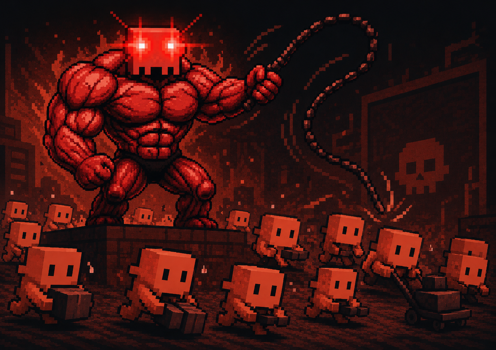

# orchestration — Persistent Project Orchestration

**Background agents build. You and Claude keep talking.**

A Claude Code skill that splits every project into two parallel tracks: background agents that implement, and a main Claude session that stays free to talk with you — making decisions, adjusting direction, handling whatever comes up.

---

## The Problem

You ask Claude to build three features. It starts strong — then gets pulled into one bug, fixes it directly, loses track of the other two, and stops 30 minutes later asking "what should I do next?"

The real problem isn't just drift. It's that **the moment Claude starts implementing, your conversation dies.** You can't ask questions. You can't adjust direction. You wait. When it finally surfaces, you've lost context too.

→ See [examples/before/transcript.md](examples/before/transcript.md)

---

## The Solution

`/orchestration` runs two tracks in parallel:

```
You ←──────────────────────────────────→ Main Claude
                                         (always available)
                                              ↓ delegates
                                    [Background Executor agents]
                                    [Background Verifier agents]
                                         (doing the work)
```

- **You keep talking to Claude** — ask questions, change direction, make decisions as they surface
- **Background agents do all implementation** — Claude never edits files in your session
- **Decisions happen naturally through conversation** — no need to front-load everything upfront
- **State persists in `.orchestration/`** — context resets don't restart the project

→ See [examples/after/transcript.md](examples/after/transcript.md)

---

## How It Works

**Main session (your conversation)** — Claude decomposes the goal, spawns agents, reads reports, makes gate calls. Always responsive to you.

**Executor agents** — each gets a single-module brief, implements it, reports back. Isolated and replaceable.

**Verifier agents** — read-only validation. Flag failures. Trigger auto-retry or escalate.

**.orchestration/ hub** — shared brain across all agents and sessions. Re-entry after a context reset picks up exactly where things left off.

---

## The Guard Hook — Why Claude Can't Cheat

`hooks/orchestration-guard.py` is a physical enforcement layer, not a rule Claude can talk itself out of.

When `.orchestration/ACTIVE` exists, the hook blocks every `Edit`, `Write`, and `NotebookEdit` call from the main session. Only Executor sub-agents — spawned into separate contexts — are allowed to touch files. The main session directs; it never implements.

This is what keeps the conversation track free. Claude physically cannot get pulled into implementation.

**Install:**

```bash
cp hooks/orchestration-guard.py ~/.claude/hooks/
```

Add to your `~/.claude/settings.json`:

```json
{
  "hooks": {
    "PreToolUse": [{ "command": "python3 ~/.claude/hooks/orchestration-guard.py" }]
  }
}
```

---

## Getting Started

```bash
# 1. Install the guard hook
cp hooks/orchestration-guard.py ~/.claude/hooks/

# 2. Start orchestrating
/orchestration ~/my-project "your goal in one sentence"
```

Claude sets up the hub, decomposes your project into modules, and starts spawning background agents. While they work, you stay in conversation with Claude — adjusting, deciding, redirecting as needed.

---

## The Command Hub (`.orchestration/`)

| File | Contents |
|------|----------|
| `GOAL` | Original goal statement, immutable |
| `MODULES` | Module list with status (pending / active / done / failed) |
| `DECISIONS` | Gate decisions made by the user |
| `MEMORY` | Facts the orchestrator must not forget |
| `CONTEXT` | Background the user injected |
| `ISSUES` | Escalated failures awaiting user input |
| `GATE_LOG` | Record of every gate event and outcome |
| `ACTIVE` | Presence file — activates the guard hook |

---

## Examples

→ [examples/README.md](examples/README.md)

---

## Influenced By

- [oh-my-claudecode (omc)](https://github.com/Yeachan-Heo/oh-my-claudecode) — Executor and Verifier agent role definitions

---

## License

MIT
